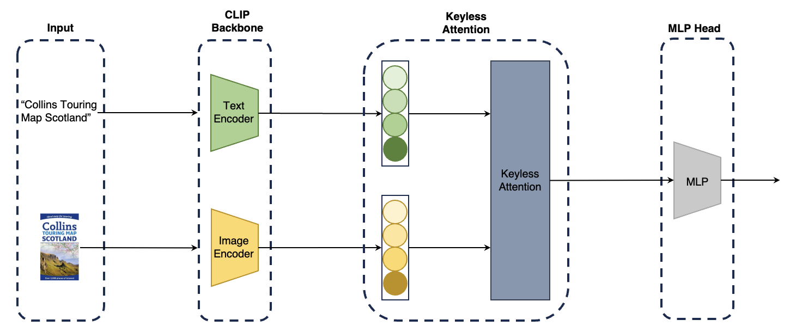

# BookGenreClassifier-CLIP-Backbone
2023 인공지능경진대회@JBNU, Grand Prize(전북대학교 총장상)

## Model Architecture
 

## Prerequisties
You can install the required packages with a conda environment by typing the following command in your terminal:
```bash
conda create -n CLIP_KA python=3.9
conda activate CLIP_KA
pip install -r requirements.txt
```
## Usage
### Train our model from scratch
You can train the model with the best hyperparameters for each dataset by typing the following command in your terminal:
```python
python ./src/main.py --dataset taobao \
                     --lr 1e-4 \
                     --weight_decay 0 \
                     --tda_layers 4 \
                     --gnn_layers 1 \
                     --emb_dim 64 \
                     --num_epochs 100 \
                     --batch_size 1024
```
